<div align="center">



<a href="https://git.io/typing-svg">
  
</a>

<br/>


<a href="https://www.linkedin.com/in/ismael-fonseca-cepeda11/"></a>
<a href="mailto:TU_CORREO@email.com"></a>
<a href="https://github.com/Fonzi11"></a>


</div>

<table>
<tr>
<td width="42%" align="center" valign="top">
  
</td>
<td width="58%" valign="top">

### `> whoami`

I am a dual-degree undergraduate student in **Mechatronics Engineering and Bioengineering** at **Pontificia Universidad Javeriana** (Bogotá, Colombia). My work bridges hardware and healthcare: tangible, technology-driven solutions for complex biomedical and engineering challenges.

### `> status --current`

```yaml
thesis:      AR-Assisted Neurosurgery
stack:       HoloLens, Unity, Arun-Kabsch, ICP, CPD
deep_dive:   IoMT, PCB layout, mobile apps for hardware
shipped:     SpineTrack, Appsaludarte
off_duty:    Boom Bap beats (FL Studio), web design, JS games
